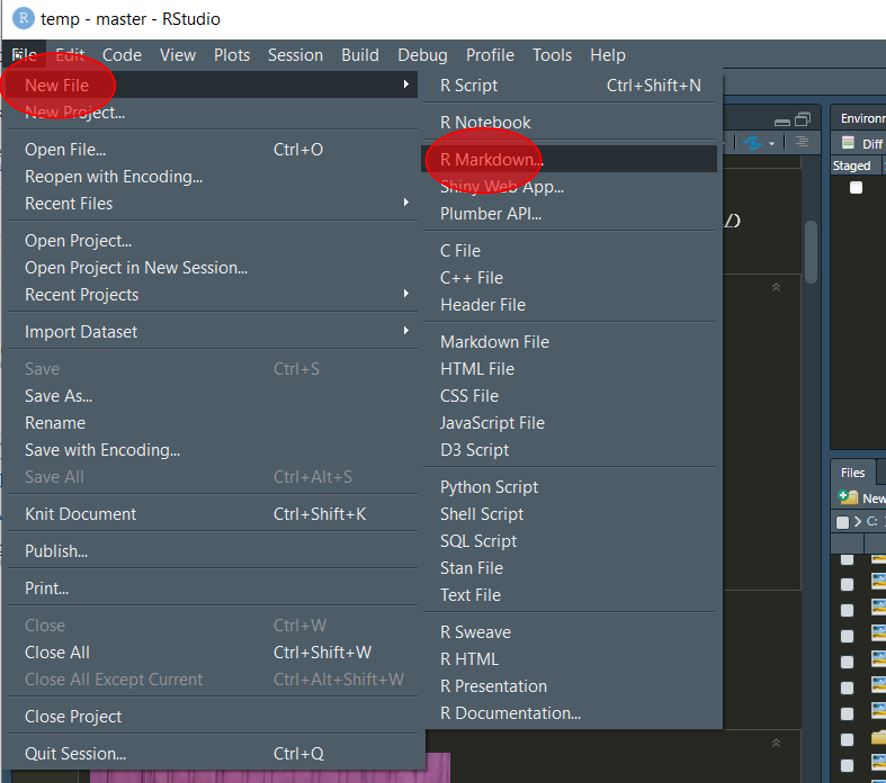
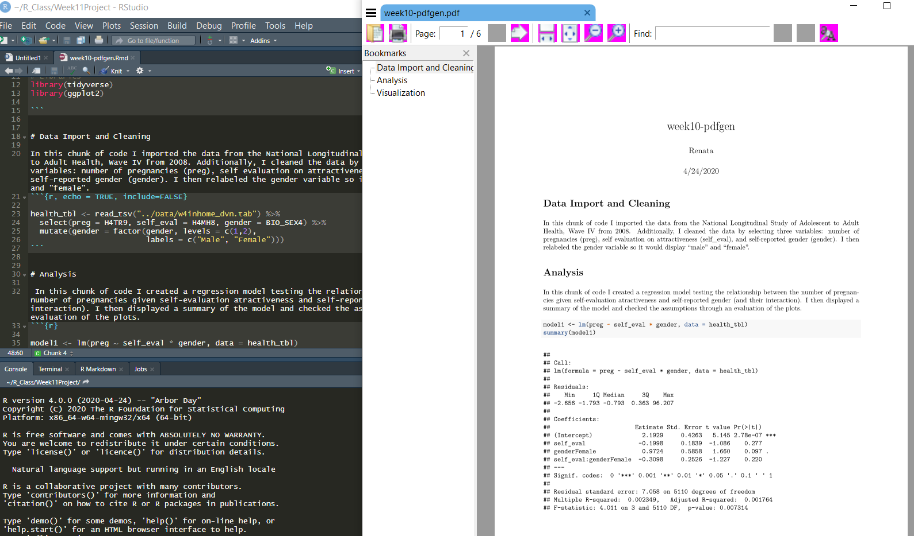
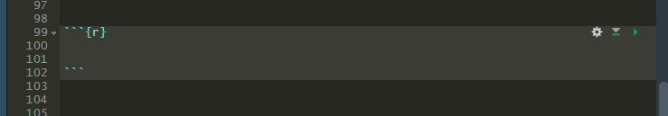
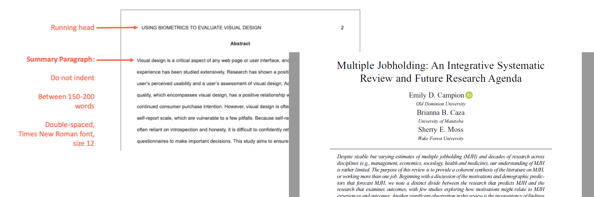

```{r setup, include=FALSE}
knitr::opts_chunk$set(echo = FALSE)
```


## rMarkdown (Part Deux!!)


This is the second part of the introduction to our R Markdown tutorial. As we saw in the first part of this tutorial, Markdown is a simple formatting syntax for authoring HTML, PDF, and MS Word documents. 
For more details on using R Markdown see <http://rmarkdown.rstudio.com>.

---

## Last time

Recall that the first part of this tutorial entailed an introduction to rMarkdown's capabilities and getting each of your personal computers to generate a default template .html file. At this point in time, you should be able to:

+ Understand the differences between R, R Studio, and rMarkdown
+ Be aware that rMarkdown has multiple capabilities
    + .html files, .pdf files, presentations, academic manuscripts
+ Be able to generate an example default .html template on your personal computer

> Is anyone not caught up with the above status points?


---

## Tutorial's goals

We'll revisit the default template creation, but also:

+ Tweak the template (by asking for different output and writing slightly different commands)
    + Document title, author(s), plot edits
    + Adding new `chunks`
        + Tweaking `chunk` options
+ Create a .pdf file as output
    + The .pdf option opens up many possibilities with rMarkdown
        + For example, academic papers with `papaja`
        
---

## Let's try the default HTML document!


---

## Creating

Recall the process to create a new rMarkdown file: File -> New File -> R Markdown

...then follow the wizard prompts



---

## Activating

When you click the **Knit** button a document will be generated that includes both content as well as the output of any embedded R code chunks within the document.

> Kulas or Renata screen-share here and walk-through if necessary


---

## You should get this:

...if you merely accept the default template, after you "knit", you should see this file pop up (note the elements and where they align in the script and output):


---

## Change the date:

Note the "tick mark". That little symbol indicates that we want to use an "inline" command (this means it's a software command *outside* of a chunk). The commands can be many different languages, but we'll mostly be using `r` 


Line numbers 8 $\rightarrow$ 10 and 18 $\rightarrow$ 20 represent two "chunks"

---
## Exercise (Part I)

Within 3 breakout rooms: 

1. Change the **title** of your .html document to some creative description of your choice
2. Change the **authorship** to YOU (or your nickname)
3. Change the **color** of the points within the `plot(pressure)` scatterplot

...when we reconnect, screenshare your output (everyone)


---

## "Chunks"

Chunks are blocks of data analyses. This is where we'll be requesting analyses and writing the `R` code commands you're already familiar with...

You can edit the output of your chunk to determine what your final document displays. For example with the command `echo = ` 
 
 

---

## Creating a chunk:



To edit the output of a chunk you can add different arguments to the `{r}` command: 


---

## Great resource

There's a very accessible and *appropriately detailed* high-level overview of everything you probably need to get started (and launch off) with Markdown [located here](https://codingclubuc3m.rbind.io/post/2019-09-24/) 


---

## Exercise (Part II)

Within 3 (different) breakout rooms:

4. Create a new chunk in your document
    + The new chunk will request a histogram of the `speed` variable within the `cars` dataset
5. Edit the output of your chunk using the commands we learned (play with different `TRUE/FALSE` commands)

...when we reconnect, screenshare your output (everyone)


---

## Papaja! 

The following site walks you through the installation of `papaja` and more generally explains the need to use a LaTex add-on with .pdf files:

<https://crsh.github.io/papaja_man/introduction.html#getting-started> 


---
## What papja documents "look like"

There are two primary output formats that you'll be interested in: 
1. APA formatted manuscript (`man`), and
2. Journal formatted manuscript (`jou`)



---
## Let's first try a generic .pdf file!!!!

1. There are MikTex and TinyTex options 
2. Generate a template markdown document (but as a .pdf)

> Let's do an experiment and have half install TinyTex and half MikTex!


---
## Exercise (Part III)

In (yet again) 3 different breakout rooms, help each other:

1. Change your previous **.html** output to a **.pdf**
2. Install `papaja` from GitHub and knit a template manuscript
    + You'll also need to have the `devtools` package installed
    + ...then type `devtools::install_github("crsh/papaja")`

...then share your output (everyone)


---
## The End

That's it for tonight - any questions?


...any requests for what to cover in the next rMarkdown session? 
Hey Look! [Interactive Markdown Documents](https://www.youtube.com/watch?v=sQjnvaf072M)